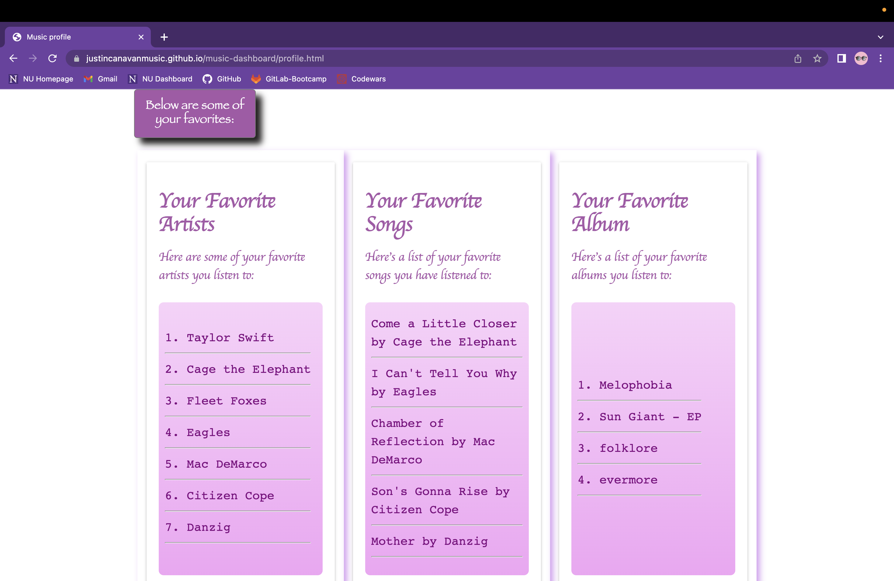

# Music Dashboard

Designed for any and all music lovers, the music dashboard gives users access to an interactive musical database of artists, albums and songs, as well as musical events and concerts. The webpage is composed of three primary pages, the search page where users can search and like albums and songs. The second page acts as a profile page where users can see their liked songs and albums, as well as their favorite artists which are ranked based on how much of the artists content the user has liked. The third page give users the ability to search up an artist and input their postal code to view concerts near them that are similar to the artist they searched. On this page the concert name, venue location and time of the event will all be displayed in a table. 

The webpage utilizes local storage to keep track of all the persistent data for users: liked songs and liked ablums. By using this data, the webpage will reassess the users favorite artists anytime they view their profile in case the user updates their liked content. 

Though building this webpage all contributors were met with a series of challenges we needed to solve by working together. It was great practice working with others to simulate a real world project in which you must collaberate with peers and divide up the work. The most challenging aspect was utilizing github to push, pull and merge the code of our peers, perticularly when conflicts emerged. However through this challenge we learned to excel in clear communication to limit conflicting code.

# Installation

No installation necessary just click the link below to view!

[Click here to go to the live link!](https://justincanavanmusic.github.io/music-dashboard/)

# Usage

To start using the music dashboard just input any text into the search bar presented when the page first loads. The webpage will primarily display the top results that match this search. You will always recieve the top 5 songs and the top 5 artists for any given search. On this page you have the ability to click on the headphone icon to view the song on Apple Music if you wish to listen to the song.

Back on the webpage you have the ability to select any artist name to view that artists entire collection of albums. Once you select an artist the webpage will load all the artists albums with pictures of the album covers as well as links to view that specific album.

Once the user selects a perticular album they will be directed to a page containing all the songs on the album. Here the user has the ability to like songs, unlike songs, as well as like the whole album or unlike the whole album.

At any point the user is able to navigate over to their profile page by clicking on the button in the top right side of the screen. Here users will be displayed with all their liked content as well as their favorite artists that are ranked based on how many songs and albums the user has liked (songs count for a score of 1 while albums count for a score of 5. i.e. 6 liked songs > 1 liked album).

Going back to the search page, the user at any point also has the ability to navigate to the Concert page. Here the user can search up any artist and input a zip code in order to recieve recommended concerts in that area based on the artist genre and style. The user can find the name of the concert and those preforming as well as the venue location and the time of the event. 

# Cedits

## [Materialize](https://materializecss.com/)

- Utilized the materialize css library for general styling, spacing and sizing of various elements throughout the webpage.

## [jQuery](https://jquery.com/)

- Utilized jQuery for easier, cleaner JavaScript syntax perticulalry when manipulating the DOM.

## [jQuery ui](https://jqueryui.com/)

- Utilized two of jQuery ui's widgets: autocomplete for the main search input on the starting page and menu for the 'like song' button.

## [Day.js](https://day.js.org/)

- Utilized Day.js for formatting dates of future event on the concerts page.

## [Google Fonts](https://fonts.google.com/about)

- Utilized a variety of google fonts throughout the webpage for a cleaner look.

## [Rapid API](https://rapidapi.com/hub)

- Utilized rapidapi.com to obtain a free trail of our main API, Shazam, which has a massive music database.

## [Shazam API](https://rapidapi.com/apidojo/api/shazam)

- Utilized Shazam's API to retrieve data on artists, albums and songs, as well as the top results based on a users search.

## [SeatGeek API](https://platform.seatgeek.com/)

- Utilized SeatGeek's API to retrieve recommended concerts based on a users search within 30 miles of their specified zip code. 

# Features

This web application has many feature grand and small, from sticky buttons that make navigation easier to local variables that store the last search results to allow for less calls to the API while also having necessary objects and information on songs and albums readily available should the user like a song or album. 

One feature, although simple, adds a lot to the search page. The search bar uses the jQuery autocomplete widget which utilizes a local storage varible that keeps track of all search history. If we had access to a paid version of the shazam API in which we could make multiple calls to the server per second, this autocomplete could be replaced with the list of top results that constantly updates as the is typing. However given the limitations of the API the search history autocomplete was a good second choice.

Another cool feature is the automatic ranking of the users favorite artists. Rather than allowing the user to like or follow a perticular artist it seemed better to track all the users artists and assess the users favorite based on how much content they liked per artist. If we had another day or two to work on the project we would have utilized this information in the concert page so that the user doesn't need to manualy input an artist to search for concert recommendation. Rather, we could create a dropdown menu that displays the users top artists and have them select which kind of concert they're looking for based on that information.

Lastly, if we had another week or so we could easily implement user created playlists to the web application. Since all the information is being stored into objects it would be rather easy to make a playlist object that takes in a playlist name and an array of song objects each with their own name and artist object. While it was in our original plans the manipulation of DOM, the traversing API data and overall styling and navigation of the webpage was a larger task than we had anticipated so we had to cut it out from our original designs. 

# Contributors
- [DANIEL MANAGLIA](https://github.com/dmanaglia/)
- [JUSTIN CANAVAN](https://github.com/justincanavanmusic/)
- [AHMAD BUSTAMI](https://github.com/Ahmad92894/)
- [AWELE ANITA LAN](https://github.com/Awele1111/)
